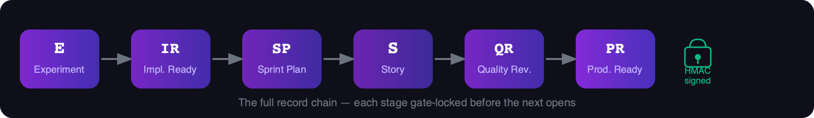
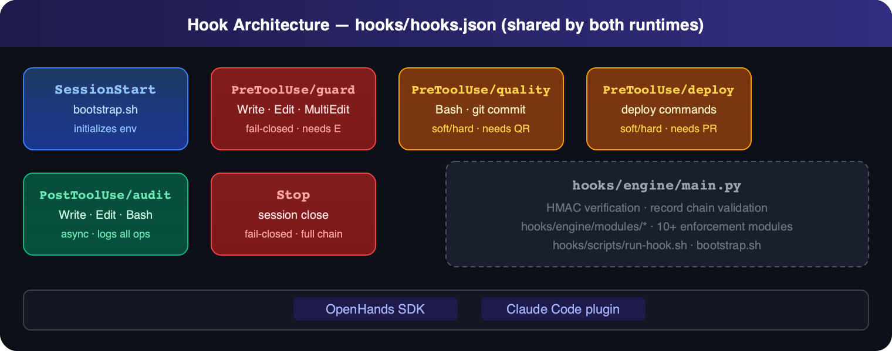
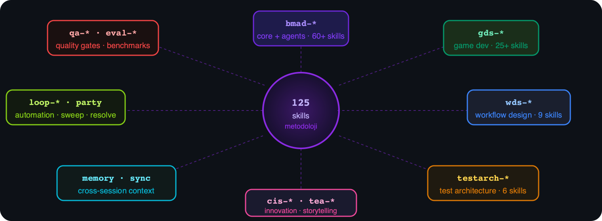
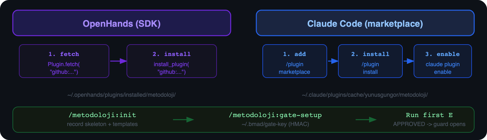

<div align="center">

# metodoloji

**BMAD methodology as a dual-runtime plugin** — 125 skills, 123 bridge TOMLs and
mechanical gates that make the record chain **E → IR → SP → S → QR → PR**
actually enforceable in [OpenHands](https://github.com/All-Hands-AI/OpenHands) and [Claude Code](https://code.claude.com).




</div>

---

## Built on BMAD 🧡

**metodoloji is inspired by — and would not exist without — the
[BMAD-METHOD](https://github.com/bmad-code-org/BMAD-METHOD) project**
(*Breakthrough Method for Agile AI-Driven Development*) and the wider
[BMAD ecosystem](https://bmadcode.com). We are deeply grateful to the BMad Code team
for creating and open-sourcing a methodology that puts thinking back into
agent-driven development. This plugin adapts their ideas into a ready-to-install
plugin with mechanical enforcement. **Thank you! 🙏**

---

## What it does

Agentic coding tools are great at writing code — and too eager to write it before
anyone has *thought*. `metodoloji` fixes that **mechanically**: hooks watch every
edit, commit and deploy, and refuse to proceed unless the methodology says so.

<div align="center">

</div>

**Guard (fail-closed)** — writing code requires an **approved experiment (E)**. No approval, no edit.

**Quality / Deploy (soft or hard)** — `git commit` and deploy commands require the full record chain (IR → SP → QR → PR).

**Stop (fail-closed)** — the session cannot close with unfinished stories or unapproved changes.

**PostToolUse audit** — every write, edit and bash call is logged to `.metodoloji/logs/hook-audit.log` asynchronously.

---

## Skill Ecosystem

125 skills bridged to methodology records via 123 custom TOMLs. Skills are namespaced by domain:

<div align="center">

</div>

| Namespace | Skills | Description |
|-----------|--------|-------------|
| `bmad-*` | 60+ | Core methodology — agents, research, architecture, PRD, story, review |
| `gds-*` | 25+ | Game development studio — design, code, test, playtest |
| `wds-*` | 9 | Workflow design studio — brief → scenarios → UX → assets → evolution |
| `bmad-testarch-*` | 6 | Test architecture — framework, design, ATDD, NFR, trace, CI |
| `bmad-cis-*` / `bmad-tea-*` | 8 | Creative intelligence — innovation, storytelling, design thinking |
| `bmad-loop-*` | 3 | Automation loop — setup, sweep, resolve |
| `qa-*` / `eval-*` | 4 | Quality gates and benchmark runners |
| `memory` / `sync` | 2 | Cross-session context persistence |

---

## Quick start

### Platform Installation

<div align="center">

</div>

### OpenHands (SDK)

```python
from openhands.sdk.plugin import Plugin

# Load from GitHub
Plugin.load(Plugin.fetch("github:yunusgungor/metodoloji"))

# Or persist it and auto-load in later sessions
from openhands.sdk.plugin import install_plugin
install_plugin("github:yunusgungor/metodoloji")  # → ~/.openhands/plugins/installed/metodoloji/
```

### Claude Code (marketplace)

```
/plugin marketplace add https://github.com/yunusgungor/metodoloji
/plugin install metodoloji@metodoloji
claude plugin enable metodoloji
```

> The plugin is **opt-in** (`defaultEnabled: false`) — enable it explicitly, as above.

### First session

```bash
/metodoloji:init          # install the record skeleton + templates into your project
/metodoloji:gate-setup    # generate ~/.bmad/gate-key (machine-local, HMAC signing)
```

Then run an experiment, get it **APPROVED** through the gate, and the guard opens
your code scope (`{metodoloji-root}` = this plugin's installation root —
`~/.openhands/plugins/installed/metodoloji/` on OpenHands,
`~/.claude/plugins/cache/yunusgungor/metodoloji/` on Claude Code):

```bash
python3 {metodoloji-root}/skills/bmad-research-experiment/scripts/run_experiment.py \
  --record docs/experiments/E-001.md \
  --run "python scripts/bench/bench.py"
```

---

## How it works

```
E (Experiment) → IR (Implementation Readiness) → SP (Sprint Planning)
→ S (Story) → QR (Quality Review) → PR (Production Readiness)
```

A single unified `hooks/hooks.json` is auto-discovered by **both** runtimes —
OpenHands and Claude Code share the same hook engine, and hook commands resolve
their own installation path at runtime. Methodology outputs are always written
under your **project root**, never inside the plugin.

### Security model

HMAC-signed gate records prevent forgery. The gate key lives at `~/.bmad/gate-key` — machine-local, never committed. A tampered or missing signature causes the guard hook to fail-closed immediately.

```
~/.bmad/gate-key   ←  machine-local HMAC secret
     │
     ▼
hooks/engine/main.py  ←  verifies every E record signature before allowing writes
     │
     └── on failure → exit(1) → Claude/OpenHands blocks the tool call
```

### Directory layout

```
metodoloji/
├── hooks/
│   ├── hooks.json          # single manifest, shared by both runtimes
│   ├── scripts/            # run-hook.sh, bootstrap.sh, hook-entry.sh
│   └── engine/             # main.py + 10+ enforcement modules
├── skills/                 # 125 skill directories (SKILL.md + customize.toml)
├── custom/                 # 123 bridge TOMLs  (skill ↔ record mappings)
├── configs/                # 17 named config packages (default.yaml)
├── templates/              # record templates: _template_{E,IR,SP,S,QR,PR}.md
├── commands/               # slash commands: init, gate-setup, audit, verify
├── docs/
│   ├── images/             # infographic PNGs (record-chain, hook-architecture, …)
│   ├── USAGE-GUIDE.md      # full reference (records, gates, security, FAQ)
│   ├── CLAUDE.md           # Claude-specific setup and behavior
│   └── experiments/        # sample experiment records (E-001 … E-013)
└── bmad/                   # BMAD module help CSVs and config
```

---

## Documentation

| Document | Contents |
|----------|----------|
| [**Usage Guide**](docs/USAGE-GUIDE.md) | Everything: records, gates, security, troubleshooting, FAQ |
| [Claude Code guide](docs/CLAUDE.md) | Claude-specific setup and behavior |
| [Training lessons](docs/TRAINING-LESSONS.md) | Lessons learned from running the methodology |
| [Dev methodology](docs/bmad/development-methodology.md) | Internal development methodology |

---

## License

MIT. Based on [BMAD-METHOD](https://github.com/bmad-code-org/BMAD-METHOD)
