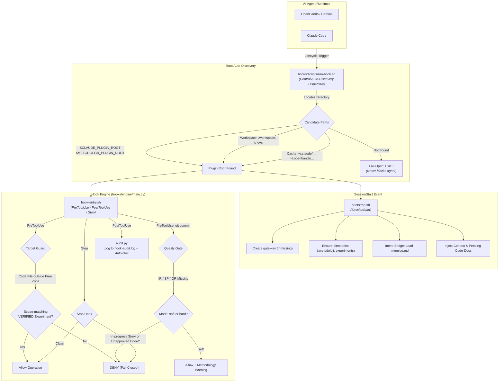
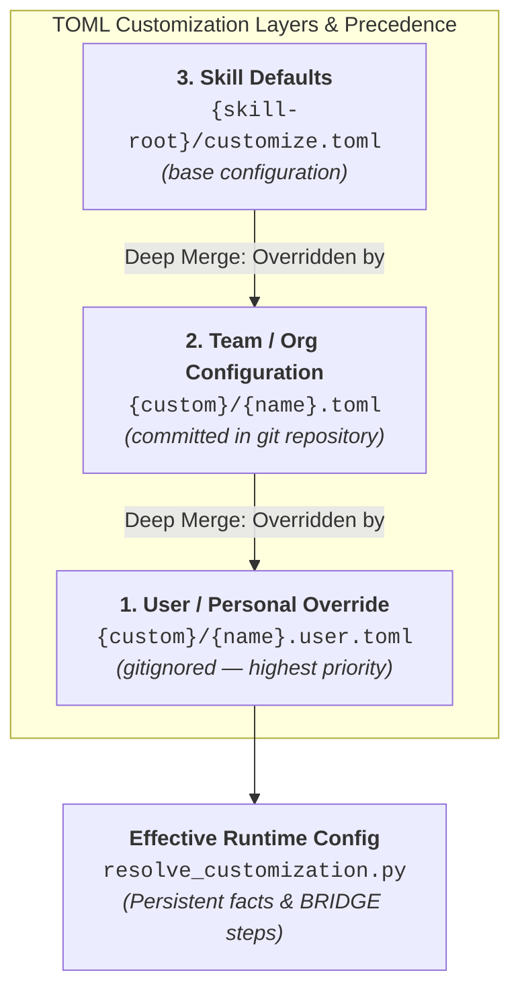
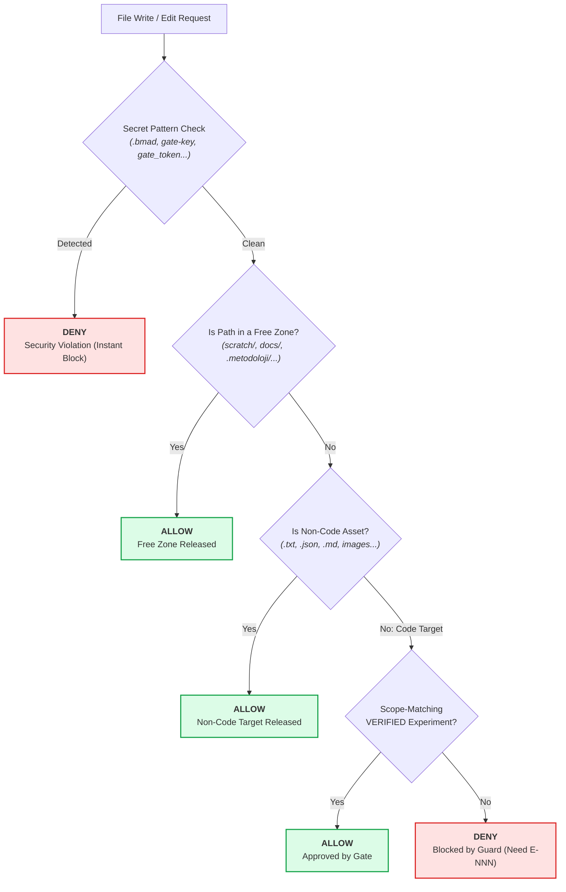

# OpenHands/Claude Code Metodoloji Plugin — Comprehensive Usage Guide

> **Version:** 1.0.0 | **Author:** yunusgungor | **License:** MIT
>
> This document is the complete and detailed usage guide covering every aspect of the `metodoloji` plugin.
> The plugin is **dual-runtime**: one unified hook engine serves both
> [OpenHands](https://github.com/All-Hands-AI/OpenHands) and [Claude Code](https://code.claude.com).

---

## Table of Contents

1. [Overview](#1-overview)
2. [Architecture](#2-architecture)
3. [Installation](#3-installation)
4. [Initial Configuration](#4-initial-configuration)
5. [Record Chain (E → IR → SP → S → QR → PR)](#5-record-chain)
6. [Hook Engine and Mechanical Gates](#6-hook-engine-and-mechanical-gates)
7. [Code Docs (Automatic Documentation)](#7-code-docs-automatic-documentation)
8. [Intent Bridge and Memlog](#8-intent-bridge-and-memlog)
9. [Skill Bridge and TOML Customization](#9-skill-bridge-and-toml-customization)
10. [Commands](#10-commands)
11. [Templates](#11-templates)
12. [Free Zones and Restricted Areas](#12-free-zones-and-restricted-areas)
13. [Security (Gate Key and HMAC)](#13-security)
14. [Audit and Health Check](#14-audit-and-health-check)
15. [SkillOpt Training and Self-Evolution](#15-skillopt-training-and-self-evolution)
16. [Troubleshooting](#16-troubleshooting)
17. [Frequently Asked Questions](#17-frequently-asked-questions)
18. [Glossary](#18-glossary)

---

## 1. Overview

### What Does the Plugin Do?

`metodoloji` is the plugin implementation of the **BMAD (Build Methodology for Agent-Driven development)** methodology for OpenHands and Claude Code. It ships with 123 skills + 120 customization TOMLs (33 BRIDGE active) + mechanical gates + a record chain.

Core components:

| Component | Function |
|-----------|----------|
| `skills/` | 123 BMAD skills (native body) |
| `custom/` | 120 customization TOMLs (33 active with BRIDGE: `activation_steps_append`/`principles` → links native outputs to methodology records) + `config.toml` (soft/hard gates) |
| `hooks/` | `hooks.json` (unified, auto-discovered by both runtimes) + `engine/` (Python) + `scripts/` (`bootstrap.sh`, `hook-entry.sh`) |
| `hooks/engine/` | Python engine: `main.py` (entry), `resolve_customization.py` (thin re-export), `modules/` (guard, audit, stop, utils, config, archive, bash_targets, code_docs) |
| `bmad/` | Module data (bmm, cis, gds, wds, tea, core, bmb, bmad-loop, `_config`) + `bmad/scripts/` (canonical `resolve_customization.py`, `resolve_config.py`, `memlog.py`) |
| `templates/` | IR/SP/QR/PR/S/E + README/tech-debt record templates |
| `commands/` | `/metodoloji:init`, `/metodoloji:gate-setup`, `/metodoloji:verify`, `/metodoloji:audit` |
| `bmad_benchmarks/`, `configs/`, `scripts/train_bmad.py` | SkillOpt training/skill-tuning infrastructure (see §15) |

### Core Principle

The plugin **mechanically blocks writing code without experiment approval**.
To write code you must first create an experiment (E-NNN) record, have the gate run the
measurement itself, and get a scope-matching VERIFIED approval. This mechanically breaks
the "write code without thinking" habit.

### Research Modes

| Mode | Type | Record Location | Usage |
|------|------|-----------------|-------|
| **Mode A** | Quantitative/Empirical | `docs/experiments/` | The only legitimate path to code production — mechanical gate |
| **Mode B** | Qualitative | `docs/research/` | Literature review, interviews, case analysis |
| **Mode C** | Design | `docs/design/` | UX/architecture designs |
| **Mode D** | Contextual | `docs/research/` | Market research, competitive analysis |

---

## 2. Architecture

### Directory Structure

```
metodoloji/
├── .plugin/
│   ├── plugin.json              # Plugin definition (name, version, repository)
│   └── (OpenHands loads from the repo/install root)
├── .claude-plugin/
│   └── marketplace.json         # Claude Code marketplace manifest (defaultEnabled: false)
├── hooks/
│   ├── hooks.json               # Unified hook definitions (both runtimes auto-discover)
│   ├── engine/                  # Python engine
│   │   ├── main.py              # Entry point (mode via HOOK_TYPE/argv, --runtime= flag)
│   │   ├── resolve_customization.py  # Thin re-export of bmad/scripts/resolve_customization.py
│   │   ├── tests/               # Engine unit tests (pytest)
│   │   └── modules/
│   │       ├── __init__.py      # Module exports
│   │       ├── config.py        # Constants (paths, thresholds, code classification, strictness)
│   │       ├── utils.py         # normalize_hook_input, norm_path, is_free, is_code_target, intent bridge
│   │       ├── archive.py       # Archive processing (tar/zip — bomb protection)
│   │       ├── bash_targets.py  # Bash command target detection
│   │       ├── guard.py         # PreToolUse guard + quality + deploy logic
│   │       ├── audit.py         # PostToolUse audit trail + code-docs triggers
│   │       ├── stop.py          # Stop logic (session close block)
│   │       └── code_docs.py     # Code docs generation/recall/index
│   └── scripts/
│       ├── bootstrap.sh         # SessionStart: gate-key + directories + context + intent
│       └── hook-entry.sh        # Single dispatch point → Python engine
├── skills/                      # 123 BMAD skill directories
├── custom/                      # 120 TOMLs (33 BRIDGE active) + config.toml
├── bmad/                        # Module data + scripts (resolve_customization, memlog)
├── templates/                   # Record templates
├── commands/                    # Slash-command definitions (.md)
├── scripts/                     # check-plugin.sh, check-custom.sh, record creators, bench
└── docs/                        # Documentation + record examples
```

### Hook Flow Diagram



### Root Resolution Rules

| Placeholder | Value |
|-------------|-------|
| `{project-root}` | Target project root (`$CLAUDE_PROJECT_DIR` / `$OPENHANDS_PROJECT_DIR`, cwd fallback) |
| `{metodoloji-root}` | Plugin installation root (resolved at runtime: `$CLAUDE_PLUGIN_ROOT` / `$METODOLOJI_PLUGIN_ROOT` if set, else `~/.claude/plugins/cache/yunusgungor/metodoloji/` for Claude Code or `~/.openhands/plugins/installed/metodoloji` for OpenHands) |
| `{skill-root}` | The skill's location within the plugin |

**Output rule:** Methodology outputs (story, experiment, planning, test artifacts, `bmad-output/`) are always created under `{project-root}` — never under `{metodoloji-root}`.

**Source-material rule:** Methodology *source* — templates (`templates/_template_*.md`), TOML configuration (`bmad/config.toml`, `custom/*.toml`), and plugin scripts (`hooks/engine/*.py`, `bmad/scripts/*.py`) — is **read** from `{metodoloji-root}`. The plugin is read-only for methodology *output*: records, artifacts, and bmad-output are never written into it. The one deliberate exception is the **customization** layer — `bmad-customize` writes user overrides under the plugin's `custom/`. Decide by what the file *is* (record/artifact → `{project-root}`; template/config/script → `{metodoloji-root}`), not by where a path text places it.

**Tooling-as-instrument rule:** Running a plugin script (`run_experiment.py`, `resolve_customization.py`) *reads* it from `{metodoloji-root}`; the record or artifact the script **produces** is still written to `{project-root}`. The output's root is determined by what it is, not by the script that made it. Manifestos copied into the project (`docs/bmad/*-methodology.md`) are read from `{project-root}`.

---

## 3. Installation

### 3.1. OpenHands (SDK)

```python
from openhands.sdk.plugin import Plugin

# From GitHub — fetch first, then load (repo root; no repo_path needed)
p = Plugin.load(Plugin.fetch("github:yunusgungor/metodoloji"))

# From a local repository (the repository root)
p = Plugin.load("/path/to/metodoloji")

# Or persist it and auto-load in later sessions:
from openhands.sdk.plugin import install_plugin
install_plugin("github:yunusgungor/metodoloji")  # → ~/.openhands/plugins/installed/metodoloji/
```

### 3.2. Claude Code (marketplace)

```
/plugin marketplace add https://github.com/yunusgungor/metodoloji
/plugin install metodoloji@metodoloji
claude plugin enable metodoloji
```

> The plugin is **opt-in** (`.claude-plugin/marketplace.json` sets `defaultEnabled: false`
> on the plugin entry and in the plugin manifest): the fail-closed guard hooks must be
> enabled explicitly, as above. The same unified `hooks/hooks.json` is auto-discovered
> by **both** runtimes — hook commands resolve their own installation path at runtime.

### 3.3. Manual Installation

```bash
# 1. Clone the repository
git clone https://github.com/yunusgungor/metodoloji.git
cd metodoloji

# 2. Verify the plugin directory structure
ls .plugin/plugin.json             # Plugin definition
ls hooks/hooks.json                # Unified hook definitions (both runtimes)
ls hooks/engine/main.py            # Engine entry point
ls .claude-plugin/marketplace.json # Claude Code marketplace manifest

# 3. Python 3.11+ required (for tomllib)
python3 --version  # must be >= 3.11
```

### 3.4. Prerequisites

| Requirement | Minimum | Note |
|-------------|---------|------|
| Python | 3.11+ | `tomllib` for TOML merge; engine falls back `python3 → python → py` |
| OpenHands / Claude Code | Latest | Plugin/hook API support |
| Git | 2.x | Version control |
| Shell | POSIX `sh` | Git Bash on Windows is fine |

**Cross-platform notes (Windows):**
- Bootstrap auto-detects Python via `python3 → python → py`, then common Windows install paths
- Windows paths are converted via `cygpath` when available under Git Bash
- `chmod 600` on the gate key is silently ignored on Windows (no POSIX permissions)
- `.sh` files are normalized to LF via `.gitattributes`

---

## 4. Initial Configuration

### 4.1. Step-by-Step Initial Setup

#### Step 1: Start the Plugin

The plugin loads automatically. The `SessionStart` hook (`bootstrap.sh`, fail-open):

1. Creates `~/.bmad/gate-key` if it does not exist (0600 where supported)
2. Creates missing directories (`docs/experiments/`, `.metodoloji/logs/`)
3. Reads the active `.memlog.md` and exports `METODOLOJI_INTENT` / `METODOLOJI_SCOPE`
4. Injects context: record chain reminder + gate key status + pending/recent code docs

#### Step 2: Set Up the Record Skeleton

```
/metodoloji:init
```

| Action | Detail |
|--------|--------|
| Create directories | `docs/experiments/`, `docs/development/stories/`, `docs/research/`, `docs/design/`, `docs/bmad/`, `scratch/` |
| Copy templates | E, BD, C, IR, SP, QR, PR, S templates + README + tech-debt + scratch-README into the respective directories |
| Manifesto copies | Bridge and methodology manifestos under `docs/bmad/` |
| Warning | Tells you to run `/metodoloji:gate-setup` if the gate key is not installed |

#### Step 3: Install the Gate Key

```
/metodoloji:gate-setup
```

Creates `~/.bmad/gate-key`. This file:
- **Lives outside the repository** (is never committed)
- **Has 0600 permissions** (POSIX; ignored on Windows)
- Is used for **HMAC validation**
- Is **machine-local** (each developer generates their own key)

```bash
# Manual installation (if /metodoloji:gate-setup does not work):
python3 {metodoloji-root}/skills/bmad-research-experiment/scripts/run_experiment.py --init-secret

# Check without creating:
python3 {metodoloji-root}/skills/bmad-research-experiment/scripts/run_experiment.py --check-secret
```

#### Step 4: Run the Health Check

```
/metodoloji:audit
```

or directly:

```bash
sh scripts/check-plugin.sh
```

Check coverage: §0 gate key, §1 engine selfcheck, §2 manifesto wiring, §2b bridge runtime
visibility, §2c bridge VERIFY step, §3 approved experiment inventory, §4 documentary records,
§5 engine integrity, §5b hard-gate mode, §5c custom/ static audit, §6 development record
formats, §6a `.env` inventory, §6b tech-debt integrity.

---

## 5. Record Chain (E → IR → SP → S → QR → PR)

```mermaid
flowchart LR
    E["<b>E</b><br/>Experiment<br/><i>(Mode A)</i>"] -->|Gate 1: Readiness| IR["<b>IR</b><br/>Implementation<br/>Readiness"]
    IR -->|Gate 2: Sprint Scope| SP["<b>SP</b><br/>Sprint<br/>Planning"]
    SP -->|Implementation Tasks| S["<b>S</b><br/>Story Record<br/><i>(Dev Tasks & AC)</i>"]
    S -->|Gate 3: Quality Standards| QR["<b>QR</b><br/>Quality<br/>Review"]
    QR -->|Gate 4: Operational Readiness| PR["<b>PR</b><br/>Production<br/>Readiness"]

    classDef stage fill:#f0f4f8,stroke:#0284c7,stroke-width:2px;
    classDef gate fill:#fef3c7,stroke:#d97706,stroke-width:1px;
    class E,IR,SP,S,QR,PR stage;
```



| Record | Type | Stage | Gate Enforcement | Output Directory |
|--------|------|-------|-------------------|------------------|
| **E** | Mode A | Research/Hypothesis | Mechanical Gate (`GATE-OK-...` token) | `docs/experiments/E-NNN.md` |
| **IR** | Gate 1 | Specification/Readiness | Verified research records exist | `docs/development/IR-NNN.md` |
| **SP** | Gate 2 | Sprint Planning | S-id backlog, capacity & debt checked | `docs/development/SP-NNN.md` |
| **S** | Dev | Story Execution | Task↔AC mapping & experiment refs | `docs/development/stories/S-NNN.md` |
| **QR** | Gate 3 | Pre-Commit Quality | Coverage >= 80%, clean linters/tests | `docs/quality/QR-NNN.md` |
| **PR** | Gate 4 | Pre-Deploy Readiness | Staging test, rollback & monitoring | `docs/development/PR-NNN.md` |

### 5.1. E — Experiment Record (Mode A, Mechanical Gate)

The **only legitimate path** to code production. Writing code without an experiment is
mechanically blocked by `guard`.

**Record location:** `docs/experiments/E-NNN.md`

**Steps:**

1. **Create the experiment file:**
   ```
   templates/_template_E.md → docs/experiments/E-001.md
   ```

2. **Fill in the required fields** (`REQUIRED_DRAFT` — the gate refuses to run without them):

   ```markdown
   ## Experiment: E-001 — Database index optimization
   - **Date:** 20.08.2026
   - **Status:** planned
   - **Theory:** B+ tree indexes reduce search cost on large tables from O(n) to O(log n)
   - **Hypothesis:** H-001: "query_time_ms <= 20"
   - **Measurement Metrics:** query_time_ms <= 20
   - **Experiment Design:** inputs, procedure, control variables, reproducibility
   - **Sample Size n:** 40 (informational — the gate parses x/y from the measurement output)
   - **Code Scope:** src/db/**/*.py, lib/engine/*.py
   ```

   English field labels are **mandatory** — the gate parses them.

3. **Run the gate** (the gate executes the measurement itself and parses the value +
   denominator from the output; operator-declared numbers are not accepted):

   ```bash
   python3 {metodoloji-root}/skills/bmad-research-experiment/scripts/run_experiment.py \
     --record docs/experiments/E-001.md \
     --run "python scripts/bench/bench_query.py"
   ```

   Rules enforced here:
   - The measurement script **cannot live in a free zone** (`scratch/`, `tmp/`, `temp/`) —
     put benches in a protected directory such as `scripts/bench/`
   - A record that already has a written `Decision` cannot be re-run — open a new record
   - `--measured <value>` no longer exists — reality is mechanical

4. **Result:**
   - `APPROVED` → Guard opens this scope; you can write code
   - `REJECTED` → Revise the hypothesis and re-measure (new record)

5. **Verify before writing code:**

   ```bash
   python3 {metodoloji-root}/skills/bmad-research-experiment/scripts/run_experiment.py \
     --verify --record docs/experiments/E-001.md
   ```

   Verify exit codes and their meaning:

| Exit code | Output | Meaning |
|-----------|--------|---------|
| `0` | `VERIFIED` | APPROVED with genuine token — code may proceed within scope |
| `1` | `FORGED` | Token does not match the record's claim/measured/command — invalid |
| `1` | `REJECTED` / undecided | Did not pass the gate (or not run yet) |
| `2` | `ADVISORY-BLOCK` | Token genuine but **does not unlock code**: small sample (Wilson bound below threshold), `n unknown`, or metric MISMATCH confessed in the record |

**Cross-machine records:** the gate key is machine-local and never leaves its
machine, so an `APPROVED` record signed on another machine reports `FORGED` on
yours **by design** — this is provenance, not necessarily tampering. Do not edit
gate-written fields or re-type tokens by hand (that *would* be forging). Instead:
re-run the same measurement under a new record with your local key and declare
the link with a plain `Re-Measured-By:` line (e.g. `- **Re-Measured-By:** E-012
(date)`) at the end of the old record. `check-plugin.sh` §3 then classifies the
old record as a non-failing `CROSS-MACHINE` warning, provided the re-measurement
record itself verifies under the local key.

**Field Descriptions:**

| Field | Required | Description |
|-------|----------|-------------|
| `Date` | Yes | DD.MM.YYYY format |
| `Status` | Yes | planned / APPROVED / REJECTED |
| `Theory` | Yes | Which theory/framework it came from |
| `Hypothesis` | Yes | In H-NNN: "metric >= threshold" format |
| `Measurement Metrics` | Yes | Metric name + threshold, numeric |
| `Experiment Design` | Yes | Inputs, procedure, control variables, reproducibility |
| `Code Scope` | Yes | Glob patterns (`**` any depth, `*` single segment, `?` single char), comma/space separated; `none` = produces no code |
| `Sample Size n` | Info | Informational; the gate parses the x/y denominator from output |
| `Measurement Command` | Gate-written | The `--run` command; token binds to it — changing it after approval breaks the token (FORGED) |
| `Raw Results` | Written by gate | Measurement output |
| `Uncertainty` | Written by gate | small sample / none / n unknown |
| `Metric` | Written by gate | consistent / MISMATCH — measured metric vs record metric |
| `Decision` | Written by gate | APPROVED / REJECTED |
| `Gate Evidence` | Written by gate | GATE-OK-... token |
| `Next Step` | Written by gate | Proceed to Code / Return to Theory |

**Dry-run (preview without writing a Decision):**

```bash
python3 {metodoloji-root}/skills/bmad-research-experiment/scripts/run_experiment.py \
  --record docs/experiments/E-001.md \
  --run "python scripts/bench/bench_query.py" \
  --dry-run
```

### 5.2. IR — Implementation Readiness (Gate 1)

Checks whether research findings are ready for development.

**Record location:** `docs/development/IR-NNN.md`

**Status values:** `READY` | `INCOMPLETE` (legacy Turkish accepted)

**Checklist:**
- At least one approved research record exists (E/R/D/C-id)
- PRD or story defined
- UX spec ready (if required)
- Architecture plan ready (if required)
- Success criteria are clear and measurable
- Technical dependencies identified
- Risk assessment performed
- Plan for gaps exists (if any)

**Note:** If there are gaps, the sprint is not started; first return to the research wing.

### 5.3. SP — Sprint Planning (Gate 2)

Guarantees the sprint scope is clear, measurable, and realistic.

**Record location:** `docs/development/SP-NNN.md`

**Status values:** `planned` | `in-progress` | `completed` | `cancelled` (legacy `canceled`/Turkish accepted)

**Fields:**
- Sprint goal (single sentence)
- Story list (S-id + priority + story points)
- Capacity (compared against team velocity)
- Technical debt assessment
- Blockers and resolution plans
- Dependencies

**Checklist:**
- Sprint goal is clear and expressible in a single sentence
- S-id record exists for each story
- Story points assigned and realistic
- Sprint capacity fits the team velocity
- Technical debt assessed and time-boxed
- Blockers identified and a resolution plan exists

### 5.4. S — Story Record

Created during sprint planning and tracked throughout implementation.

**Record location:** `docs/development/stories/S-NNN.md`

**Status values:** `backlog` | `sprint` | `in-progress` | `review` | `done` | `blocked`

**Required sections:**

1. **Frontmatter:**
   ```yaml
   ---
   experiment_refs:
     - id: E-001
       scope: "src/db/**"
       status: APPROVED
   ---
   ```

2. **Acceptance Criteria:** Required fields for each AC:
   - `[AC-NNN]` identifier
   - `Experiment:` field (E-NNN, or `—` together with the `[HYPOTHESIS]` tag)
   - `Type:` field (`agent-verifiable` | `user-evaluable` | `hybrid`)
   - `Measured:` field (`true` | `false`)
   - `Verify:` field (verification method)

3. **Technical Tasks:** Each top-level task (`- [ ]`/`- [x]`) must have an AC reference (`AC: AC-NNN`) pointing at an existing AC id

4. **Definition of Done:** Each item must include a `DoD-NNN` identifier (and a `Verify:` field)

**Guard validations (when writing a story file):**
- `experiment_refs` → referenced experiment records exist and are verified; `PENDING`/`REJECTED` status → deny (always, regardless of gate mode)
- AC metadata → all fields filled (`Experiment` required only when `experiment_refs` exist and the AC is not `[HYPOTHESIS]`)
- Task↔AC mapping → every task linked to an existing AC
- DoD structure → identifiers present
- Methodology chain → story `done` needs a QR record; `review`/`done` needs a methodology (S) record; `SP-NNN` reference needs the SP record

**Creating records from native story files:**

```bash
# Create a methodology record from a native story file
python3 scripts/create-methodology-record.py --story docs/development/stories/S-001.md
```

### 5.5. QR — Quality Review (Gate 3)

Enforces quality standards before code is merged.

**Record location:** `docs/quality/QR-NNN.md` (canonical; `docs/development/` accepted as legacy)

**Status values:** `in-review` | `APPROVED` | `REJECTED` | `REVISED`

**Mechanical checks (automatic):**
- Test coverage >= 80%
- All tests passed (unit, integration, e2e)
- Linter and formatter clean
- Security scan clean
- No performance regression

**Documentary checks (manual):**
- Code review approval
- Documentation currency
- Breaking change migration plan
- Technical debt record (`docs/development/tech-debt.md`)

**Creating a QR:**

```bash
python3 scripts/create-qr-record.py --story docs/development/stories/S-001.md
```

### 5.6. PR — Production Readiness (Gate 4)

Guarantees operational readiness before production deployment.

**Record location:** `docs/development/PR-NNN.md`

**Status values:** `preparing` | `READY` | `WAITING`

**Main sections:**
- Staging test (deploy, smoke test, integration)
- Rollback plan (triggers, steps, database rollback)
- Monitoring and alerting (metrics, alerts, logging)
- Feature flags (kill switch, gradual rollout)
- Runbook (deploy steps, troubleshooting)
- Incident response (communication, severity, post-mortem — template `docs/development/incidents/PM-XXX.md`)
- Deploy window (timing, freeze period)

**Checklist:**
- All mechanical checks PASS
- Rollback plan ready and tested
- Monitoring and alerting set up
- Deploy window determined
- Change approval obtained

---

## 6. Hook Engine and Mechanical Gates

### 6.1. hooks.json Definition

The plugin registers **6 hook points**; one unified `hooks/hooks.json` serves both
runtimes. Matchers are regexes covering both tool vocabularies
(`Write|Edit|MultiEdit|file_editor|terminal`, `Bash|terminal`). Hook commands
self-locate the plugin root:

```json
{
  "hooks": {
    "SessionStart": [{ "hooks": [{ "type": "command", "command": "sh .../bootstrap.sh", "timeout": 30 }] }],
    "PreToolUse": [
      { "matcher": "Write|Edit|MultiEdit|file_editor|terminal", "hooks": [{ "command": "sh .../hook-entry.sh ... guard", "timeout": 10 }] },
      { "matcher": "Bash|terminal", "hooks": [{ "command": "sh .../hook-entry.sh ... quality", "timeout": 10 }] },
      { "matcher": "Bash|terminal", "hooks": [{ "command": "sh .../hook-entry.sh ... deploy", "timeout": 10 }] }
    ],
    "PostToolUse": [{ "matcher": "Write|Edit|MultiEdit|Bash|file_editor|terminal", "hooks": [{ "command": "sh .../hook-entry.sh ... audit", "timeout": 5, "async": true }] }],
    "Stop": [{ "hooks": [{ "type": "command", "command": "sh .../hook-entry.sh ... stop", "timeout": 15 }] }]
  }
}
```

Each command is a locator loop over `$CLAUDE_PLUGIN_ROOT`, `$METODOLOJI_PLUGIN_ROOT`,
the Claude marketplace cache and the OpenHands install dir; the first path containing
`hooks/scripts/hook-entry.sh` wins.

### 6.2. Guard (PreToolUse) — Fail-Closed

**Scope:** `Write`/`Edit`/`MultiEdit` (Claude Code), `file_editor`/`terminal`/`notebook_editor` (OpenHands) — normalized internally to `file_editor`/`terminal`.

**Behavior:**
- Story file (`S-NNN.md` or `N-N-slug.md`) → metadata validation runs **before** free-zone/code checks:
  - `experiment_refs` → referenced records exist and are verified (`PENDING`/`REJECTED` → always deny)
  - AC metadata, Task↔AC mapping, DoD structure, methodology chain
  - In **soft** mode (`quality_gate = "soft"`) metadata/chain violations become warn-only; the `experiment_refs` check always denies
- Code target + outside free zone → looks for a **scope-matching VERIFIED** experiment record
- No approved experiment → `DENY` (code writing is blocked)
- Secret reference in a terminal command or in written content → `DENY` (security violation; the content scan runs before the free-zone check so agent zones cannot bypass it)
- Allow result may carry warn-only `methodology_warnings` (e.g. writes outside the active memlog scope)

**Code target classification:**

| Category | Examples | Protected? |
|----------|----------|------------|
| Code basenames | `Makefile`, `Dockerfile`, `CMakeLists.txt`, `Justfile`, `Taskfile.*` | ✅ Yes |
| Code dirs | `src/`, `lib/`, `tools/`, `bin/`, `core/`, `app/` | ✅ Yes |
| Exec config | `.github/workflows/*`, `.gitlab-ci.yml`, `docker-compose*.yml`, `package.json` | ✅ Yes |
| Unknown extensions | anything not listed as non-code (fail-closed whitelist) | ✅ Yes |
| Documents | `.md`, `.txt`, `.rst` | ❌ No (free) |
| Data/config | `.json`, `.toml`, `.yaml`, `.csv`, `.log`, `.lock` | ❌ No (free) |
| Media/assets | `.png`, `.jpg`, `.svg`, fonts, archives | ❌ No (free) |
| Meta files | `.gitignore`, `README`, `LICENSE`, `.editorconfig`, `.npmrc` | ❌ No (free) |

### 6.3. Audit (PostToolUse) — Fail-Open (async)

**Scope:** `Write|Edit|MultiEdit|Bash|file_editor|terminal`

**Behavior:**
- Appends every call to `.metodoloji/logs/hook-audit.log` as one JSON line, stamped with the active session `intent` and memlog `progress`
- Produces methodology compliance warnings on story files (non-blocking) + bridge-consistency warnings (e.g. story `done` without QR)
- Detects notable events and auto-generates code docs (see §7)

**Audit record structure:**
```json
{
  "timestamp": 1757068800.0,
  "tool": "file_editor",
  "input": { "path": "src/main.py", "content": "..." },
  "output_summary": "...",
  "intent": "optimize query time",
  "progress": "in-progress",
  "related_docs": "## Related Code Docs ...",
  "methodology_warnings": ["Story file ...: AC metadata missing"]
}
```

### 6.4. Quality (PreToolUse) — Config-Gated (soft default)

**Scope:** `Bash`/`terminal` (only `git commit` commands)

**Behavior:**
- Not a `git commit` → `allow` (fast exit)
- If it is a `git commit` → chain check:
  1. Done stories exist but no IR record at all → deny (Gate 1 — readiness)
  2. Done stories lacking a QR record → deny (Gate 3 — quality)
  3. Done stories referencing an SP that lacks the SP record → deny (Gate 2 — sprint)
- Check order: IR (project-level) → QR (story-level) → SP (story-level)
- **Strictness:** with `quality_gate = "soft"` (default), a deny becomes
  `allow` + `methodology_warnings`; with `"hard"` it blocks. Read live per-call
  from `custom/config.toml [hooks]` — no reload needed.

**Example warn (soft) / block (hard) (QR missing):**
```
git commit blocked: 1 story(s) marked 'done' lack Quality Record (QR).
Stories: 1-2-user-auth. Create QR with: python3 scripts/create-qr-record.py ...
```

### 6.5. Deploy (PreToolUse) — Config-Gated (soft default)

**Scope:** `Bash`/`terminal` (deploy commands)

**Behavior:**
- No deploy command detected → `allow`
- Deploy command present → chain check (IR → QR → SP → **PR**), same shared checker as quality
- Strictness: `deploy_guard` soft/hard in `custom/config.toml [hooks]`, same semantics as quality

**Recognized deploy commands (regex, case-insensitive):** `terraform apply|destroy|plan`, `kubectl apply|rollout|deploy`, `docker (compose) up|deploy`, `ansible playbook|deploy`, `git push origin|upstream main|master|production|prod`, `deploy`

### 6.6. Stop (Stop) — Fail-Closed

**Behavior:**
1. In-progress story exists? → `DENY` (intent-aware: if the session intent names a specific story, e.g. "finish S-003", only that story blocks; a memlog `status: complete` disables the story check entirely)
2. Unapproved code change exists? → `DENY` (walks code files outside skip/free dirs)
3. Clean → `allow`, and any pending code docs (`docs/code-docs/pending/`) are surfaced as `pending_docs`

**Sprint status lookup order:** `bmad-output/implementation-artifacts/sprint-status.yaml` → legacy `_bmad-output/...` → `.metodoloji/sprint-status.yaml`

### 6.7. hook-entry.sh — Single Dispatch Point

```
hook-entry.sh guard    → guard mode (fail-closed)
hook-entry.sh quality  → quality mode (config-gated soft/hard)
hook-entry.sh deploy   → deploy mode (config-gated soft/hard)
hook-entry.sh audit    → audit mode (fail-open, async)
hook-entry.sh stop     → stop mode (fail-closed)
```

- Runtime selection: 2nd CLI arg > `METODOLOJI_RUNTIME` env > default `openhands`
- Python resolver: `python3` → `python` → `py`, then common Windows paths
- If the engine is missing or Python is unavailable:
  - guard/stop → `DENY` + exit 2 (fail-closed)
  - quality/deploy → pass silently (fail-open)
  - audit → pass silently (fail-open)

### 6.8. Bash Command Target Detection

Automatically detects which files will be modified by terminal commands:

| Command/Pattern | Detected Target |
|-----------------|-----------------|
| `> file` / `>> file` | Redirection target |
| `tee file` | Tee output |
| `sed -i '...' file` | Sed target |
| `cp src dst` / `mv src dst` | Last argument |
| `curl -o file` | -o target |
| `tar -xf archive` | Archive contents (bomb protected) |
| `unzip archive` | Archive contents |
| `git apply patch` | Patch targets |
| `python -c 'open("x","w")'` | open() target |

**Archive bomb protection (tar and zip):**
- Maximum single file: 512 MB
- Maximum compressed archive: 64 MB
- Maximum member count: 200,000
- Maximum uncompressed total: 2 GB

### 6.9. Hook Input Normalization

`normalize_hook_input()` maps the two runtime vocabularies to one schema:
Claude Code `Write`/`Edit`/`MultiEdit` → `file_editor` (with `file_path` → `path`),
`Bash` → `terminal` (with `cmd` → `command`); OpenHands tools pass through. The
runtime is detected from `METODOLOJI_RUNTIME` (set via `--runtime=` flag) or the
raw tool name.

---

## 7. Code Docs (Automatic Documentation)

`docs/code-docs/` is a structured knowledge base the hooks maintain automatically.
Six doc types (dir / prefix):

| Type | Dir | Prefix | Written when |
|------|-----|--------|--------------|
| Decision | `decisions/` | `D-` | An architecture/design file is edited substantively |
| Pattern | `patterns/` | `P-` | A class hierarchy / design-pattern signal is detected in Python edits |
| Learning | `learnings/` | `L-` | An experiment approval is detected (audit hook) |
| API | `api/` | `A-` | Route decorators (`@app.get` etc.) or `*api*.py` files are edited |
| Troubleshooting | `troubleshooting/` | `T-` | Errors/tracebacks appear in terminal output |
| Pending | `pending/` | `X-` | TODO/FIXME/HACK comments or "planned work" phrases are detected |

Mechanics:
- `hooks/engine/modules/code_docs.py` builds, writes and indexes the docs; `index.md` is regenerated on every write
- The audit hook auto-detects events per the table above; `bmad-code-docs` skill recalls/records manually (`recall_by_tag`, `recall_by_experiment`, `recall_by_type`, `recall_all`)
- `load_context_for_task()` matches task keywords/experiment ids and formats context for the LLM; recent docs and pending docs are injected at SessionStart
- The Stop hook surfaces pending docs (`pending_docs`) when the session ends with unfinished work
- `docs/code-docs/` is a **free zone** — writing there needs no experiment approval

---

## 8. Intent Bridge and Memlog

Skills write a working-memory log (`.memlog.md`) via `bmad/scripts/memlog.py`
(`init` / `append` / `set`; atomic writes; append-only body). The intent bridge
carries that context into every hook:

- **SessionStart:** `bootstrap.sh` finds the newest `.memlog.md` under
  `bmad-output/` → `.metodoloji/` → `docs/` → project root, reads `purpose` and
  `scope` frontmatter, and exports `METODOLOJI_INTENT` / `METODOLOJI_SCOPE`
- **Every hook:** falls back to reading the active memlog itself when the env
  cannot cross the process boundary (`utils._active_intent` / `_active_scope`)
- **Guard:** writes outside the active scope produce a **warn-only** message
  ("Write to X is outside the active scope 'Y'. If this is a different task,
  update the memlog purpose.") — the experiment approval logic stays authoritative
- **Audit:** each log record is stamped with `intent` and `progress`
- **Stop:** intent names a story → only that story blocks; memlog `status: complete`
  → the story check is skipped

Memlog vocabulary is host-skill-defined (entries are tagged `(idea)`, `(decision)`,
`(event)` etc.). Status is set with
`python3 bmad/scripts/memlog.py set --workspace <dir> --key status --value <complete|active|in-progress>`.

---

## 9. Skill Bridge and TOML Customization

### 9.1. Three-Layer TOML Merge (per skill)

Each skill is customized at three layers (highest priority to lowest):



> Layout note: `{custom}` prefers the **plugin layout** — a `custom/` directory at
> the project root — and falls back to the Claude layout `_bmad/custom/`. When the
> plugin is installed as a plugin, the team layer is the plugin's own
> `custom/{name}.toml` (user and team layers live in the same directory; the user
> layer wins by merge order: defaults → team → user).

**Merge rules:**
- **Scalars** (string, int, bool, float): override wins
- **Tables**: deep merge (recursive)
- **Arrays**: if all elements carry the same `code` or `id` field → merge by key; otherwise → append

**No removal mechanism:** overrides cannot delete base items — fork the skill or
override the item by its `code`/`id` with a no-op description.

### 9.2. Central Config Merge (resolve_config.py)

`bmad/config.toml` is resolved through **four layers** (last wins):
`bmad/config.toml` → `bmad/config.user.toml` → `custom/config.toml` (team) →
`custom/config.user.toml` (personal, gitignored). Artifact paths in
`custom/config.toml` point outputs at `{project-root}` (`bmad-output/`,
`docs/`), never inside the plugin.

### 9.3. Bridge TOML Structure

Each bridge TOML contains a BRIDGE instruction in `activation_steps_append`
(workflow) or `principles` (agent). BRIDGE is active in 33 skills:

**Producer BRIDGE (creates/updates records — 17 skills):**
```toml
# custom/bmad-dev-story.toml
[workflow]
activation_steps_append = [
  "BRIDGE: After implementation finishes, update the docs/development/stories/S-<seq>.md record...",
  "BRIDGE #3 (QR): Create QR record: docs/quality/QR-<seq>.md...",
  "VERIFY: After creating the record, verify the file exists with 'ls -la'."
]
```

**Feeder BRIDGE (feeds an existing record — 16 skills):**
```toml
# custom/bmad-testarch-automate.toml
[workflow]
activation_steps_append = [
  "BRIDGE: Add the test results to the Mechanical checks section of the QR-<seq>.md record..."
]
```

**VERIFY:** Producer BRIDGEs include a VERIFY step — the LLM must confirm the
record exists (`ls -la`) right after creating it. This is the automatic control
layer that prevents the BRIDGE from being skipped (audit §2c checks it).

### 9.4. Bridge Resolution

```bash
# Full customization output
python3 hooks/engine/resolve_customization.py -s skills/bmad-dev-story

# Specific field
python3 hooks/engine/resolve_customization.py -s skills/bmad-dev-story -k workflow.activation_steps_append

# Multiple fields
python3 hooks/engine/resolve_customization.py -s skills/bmad-dev-story \
  -k agent.name -k workflow.activation_steps_append
```

> `hooks/engine/resolve_customization.py` is a thin re-export; the canonical
> implementation lives at `bmad/scripts/resolve_customization.py` (stdlib only,
> Python 3.11+; `uv run` also works).

### 9.5. Manifesto Wiring

Every methodology surface (skill) must reference these documents:
- `research-methodology.md` — Research manifesto (all surfaces)
- `project-context.md` — Project context (all surfaces)
- `development-methodology.md` — Development manifesto (development wing)

Bridge document: `docs/bmad/dev-skill-to-methodology-bridge.md` (§-numbered —
`check-custom.sh` §7 audits that references in `custom/` stay in sync with it).

---

## 10. Commands

> **Note:** these command names were previously `/metodoloji:kapi-kur`, `/metodoloji:dogrula`, `/metodoloji:denetim` (Turkish).

### 10.1. `/metodoloji:init`

**Purpose:** Install the record skeleton into the target project.

**Effects:**
- Creates 6 directories (does not touch existing ones)
- Copies 8 templates (does not overwrite)
- Installs manifesto copies under `docs/bmad/`
- Warns about the gate key if missing

### 10.2. `/metodoloji:gate-setup`

**Purpose:** Generate the gate key (gate-key init).

**Effects:**
- Creates `~/.bmad/gate-key` (if missing — never overwrites: old evidence would break)
- Sets 0600 permissions (POSIX)
- Generates an HMAC key (`secrets.token_hex(32)`)
- **Never** prints/copies the key contents

```bash
python3 {metodoloji-root}/skills/bmad-research-experiment/scripts/run_experiment.py --init-secret
```

### 10.3. `/metodoloji:verify`

**Purpose:** Verify an experiment record. Uses `--verify` semantics (see §5.1 exit-code table):
`VERIFIED` / `FORGED` / `REJECTED` / `ADVISORY-BLOCK`.

### 10.4. `/metodoloji:audit`

**Purpose:** Methodology health check.

**Scope:**
1. Plugin integrity (§0–§6b, including §2b/§2c/§5b/§5c)
2. Record chain status
3. Approved experiment inventory
4. Hook configuration
5. Result report (PASS/FAIL)

### 10.5. check-plugin.sh

```bash
# Full audit
sh scripts/check-plugin.sh

# Negative test only (4 stages: .env.example removal, .gitignore .env line,
# BRIDGE removal — workflow + agent-principles)
sh scripts/check-plugin.sh --negtest
```

**Exit codes:** `0` = HEALTHY; `1` = problems found.

Also available: `scripts/check-methodology.sh` (project-side record/structure audit)
and `scripts/check-techdebt.sh` (tech-debt drift/ID/P0/orphan audit — invoked as §6b).

---

## 11. Templates

### 11.1. Template List

| Template | Target | Usage |
|----------|--------|-------|
| `_template_E.md` | `docs/experiments/E-NNN.md` | Experiment record (Mode A) |
| `_template_IR.md` | `docs/development/IR-NNN.md` | Implementation Readiness |
| `_template_SP.md` | `docs/development/SP-NNN.md` | Sprint planning |
| `_template_S.md` | `docs/development/stories/S-NNN.md` | Story record |
| `_template_QR.md` | `docs/quality/QR-NNN.md` | Quality Review |
| `_template_PR.md` | `docs/development/PR-NNN.md` | Production Readiness |
| `README.md` | `docs/development/README.md` | Development directory description |
| `tech-debt.md` | `docs/development/tech-debt.md` | Technical debt tracking |

> The E template explicitly documents the gate contract: English labels mandatory,
> gate-written fields must not be hand-written, `--measured` removed, benches must
> live outside free zones.

### 11.2. Template Usage

```bash
# New record from the experiment template
cp templates/_template_E.md docs/experiments/E-001.md
# ↓ editing: fill in E-001.md (hypothesis, design, scope), then run the gate

# Methodology record from a story (automatic)
python3 scripts/create-methodology-record.py --story path/to/story.md

# QR record from a story (automatic)
python3 scripts/create-qr-record.py --story path/to/story.md
```

---

## 12. Free Zones and Restricted Areas



### 12.1. Free Zones (No Approval Required)

The following paths are automatically released by the guard:

| Prefix/Directory | Description |
|------------------|-------------|
| `_bmad/` | Legacy BMAD module data |
| `scratch/` | Free zone — prototyping, temporary scripts, investigation notes (no gate required) |
| `graft/` | Graft code |
| `.git/` | Git directories |
| `tmp/`, `temp/` | Temporary files |
| `openhands/` | OpenHands directories |
| `.metodoloji/` | The plugin's own state directory |
| `docs/code-docs/` | Auto-maintained code docs (§7) |
| `docs/*.md` | Document files anywhere under `docs/` |
| `docs/*/raw/` | Raw data files |
| `explore_*` | Exploration files |
| Infrastructure files | `scripts/check-methodology.sh`, `skills/bmad-research-experiment/scripts/run_experiment.py` |

**Conditional self-modification zone:** `hooks/`, `scripts/`, `skills/`,
`bmad_benchmarks/` and `custom/` (plugin source trees) are released **only when
the guarded project root IS the methodology plugin's own repository** (the
plugin working on itself). In any ordinary target project those trees stay
**protected** — editing plugin source there requires an approved experiment,
like any other code.

### 12.2. Protected Areas (Approval Required)

All source code files and executable configuration files:

- Code extensions: `.py`, `.js`, `.ts`, `.jsx`, `.tsx`, `.java`, `.go`, `.rs` (and any unknown extension — classification is a whitelist)
- `Makefile`, `Dockerfile`, `CMakeLists.txt`, `Justfile`, `Taskfile.*`
- Executable CI/config: `.github/workflows/*.yml`, `.gitlab-ci.yml`, `docker-compose*.yml`, `package.json`
- `src/`, `lib/`, `tools/`, `bin/`, `core/`, `app/` directories

> Note: the gate also refuses to **run** measurement scripts from free zones —
> benches belong in protected directories (e.g. `scripts/bench/`).

### 12.3. Secret Scanning Beyond Free Zones

Even in files under `scratch/`, `tmp/`, `temp/`, content patterns such as
`.bmad` directories, `gate-key`, `bmad_gate_key`, `load_secret`, `gate_token`,
`secret_file` or `secret_env` issue a **DENY** (the content scan runs before the
free-zone check).

---

## 13. Security

### 13.1. Gate Key

- **Location:** `~/.bmad/gate-key` (OUTSIDE the repository)
- **Permissions:** 0600 (owner only; silently skipped on Windows)
- **Content:** 64-character hex string (32 random bytes)
- **Purpose:** HMAC-SHA256 validation — guarantees experiment records are not forged
- **Lifetime:** Machine-local; each developer generates their own key

### 13.2. Secret Protection

The guard engine detects and blocks the following patterns:

| Pattern | Effect |
|---------|--------|
| Terminal command containing `gate-key` / `bmad_gate_key` | DENY |
| Terminal command referencing the `.bmad` directory | DENY |
| Content containing `.bmad` / `gate-key` / `bmad_gate_key` / `load_secret` / `gate_token` / `secret_file` / `secret_env` (any path, including agent zones) | DENY |

### 13.3. HMAC Token Structure

```mermaid
flowchart LR
    subgraph Payload["Record Binding Payload"]
        C["Experiment Claim<br/><i>(e.g., query_time <= 20)</i>"]
        M["Measured Value<br/><i>(parsed mechanically)</i>"]
        I["Experiment ID<br/><i>(e.g., E-001)</i>"]
        CMD["Measurement Command<br/><i>(e.g., python bench.py)</i>"]
    end

    subgraph Security["HMAC-SHA256 Signing"]
        KEY["~/.bmad/gate-key<br/><i>(Machine-Local 32-byte Secret)</i>"]
        Payload --> HASH["HMAC-SHA256"]
        KEY --> HASH
        HASH --> TOKEN["<b>GATE-OK-&lt;hash&gt;</b><br/>Injected into Experiment Record"]
    end

    TOKEN --> VERIFY{"run_experiment.py<br/>--verify"}
    VERIFY -->|Matched & Genuine| V_OK["VERIFIED (Code Writing Unlocked)"]
    VERIFY -->|Tampered / Edited| V_FAIL["FORGED (Instant Rejection)"]
    VERIFY -->|Small Sample (Wilson)| V_ADV["ADVISORY-BLOCK (Code Locked)"]
```

Every experiment approval is signed with an HMAC token:
- In `GATE-OK-<hash>` format, generated with the gate key
- **Bound to the record's claim, measured value, experiment id, and (new-style) the `Measurement Command` field** — editing any of them after approval breaks the token (FORGED)
- Legacy records without `Measurement Command` verify via the legacy token; adding the field and changing the command afterward is treated as a downgrade (FORGED)
- If a forged token is detected, a `FORGED` result is returned

---

## 14. Audit and Health Check

### 14.1. Automatic Audit (check-plugin.sh)

```bash
sh scripts/check-plugin.sh
```

**Check sections:**

| Section | Content | On failure |
|---------|---------|------------|
| §0 | Gate key installed | `--init-secret` |
| §1 | Gate + hook engine selfcheck (guard/quality/deploy smoke tests) | `--selfcheck` |
| §2 | Manifesto + project-context wiring for every surface + consumption check | TOML parse + `resolve_customization` usage |
| §2b | Bridge visible at runtime (30 workflow + 3 agent-principles surfaces) | `resolve_customization` deep_merge |
| §2c | Bridge VERIFY instruction present (13 skills) | VERIFY marker search |
| §3 | Approved experiment inventory (`VERIFIED` / `ADVISORY-BLOCK`) | `--verify` per record |
| §4 | Documentary (B/C/D) record completeness | `--validate` |
| §5 | Engine integrity (modular engine files exist and compile) | py_compile |
| §5b | Hard gate mode validity (`custom/config.toml [hooks]`) | soft/hard contract |
| §5c | custom/ static quality audit | `scripts/check-custom.sh` §0–§7 |
| §6 | Development records format (Decision/Status + Date fields) | allowed-value check |
| §6a | `.env` inventory (`.env` absent, `.env.example` present, `.gitignore` covers `.env`) | fix files |
| §6b | Tech-debt inventory integrity | `scripts/check-techdebt.sh` |

### 14.2. Negative Tests

```bash
sh scripts/check-plugin.sh --negtest   # 4 stages
sh scripts/check-custom.sh --negtest   # §3 hard-gate + §7 bridge drift
```

`check-plugin.sh --negtest`:
1. Deletes `.env.example` → §6a must emit a WARNING (caught → restore)
2. Removes the `.env` line from `.gitignore` → §6a must emit an ERROR (caught → restore)
3. Removes the BRIDGE line from `custom/bmad-dev-story.toml` → §2b must emit a MISS (caught → restore)
4. Removes the BRIDGE from `custom/bmad-agent-dev.toml` (`agent.principles`) → §2b must emit a MISS (caught → restore)

### 14.3. BRIDGE Distribution

**Producer BRIDGE (17 skills) — create/update records:**
- `bmad-dev-story`, `bmad-quick-dev`, `bmad-dev-auto`, `bmad-agent-dev`
- `bmad-code-review`, `bmad-create-story`, `bmad-sprint-planning`, `bmad-check-implementation-readiness`
- `gds-dev-story`, `gds-quick-dev`, `gds-code-review`, `gds-create-story`
- `gds-sprint-planning`, `gds-check-implementation-readiness`
- `gds-agent-game-dev`, `gds-agent-game-solo-dev`, `wds-5-agentic-development`

**Feeder BRIDGE (16 skills) — feed data into an existing record (QR):**
- `bmad-testarch-*` (atdd, automate, ci, framework, nfr, test-design, test-review, trace)
- `bmad-qa-generate-e2e-tests`
- `gds-test-*` (automate, design, framework, review)
- `gds-e2e-scaffold`, `gds-performance-test`, `gds-playtest-plan`

*(3 of the 33 are agent-principles surfaces: `bmad-agent-dev`, `gds-agent-game-dev`, `gds-agent-game-solo-dev` — their BRIDGE lives in `[agent].principles`.)*

### 14.4. Manual Verification

```bash
# Verify a single experiment
python3 {metodoloji-root}/skills/bmad-research-experiment/scripts/run_experiment.py \
  --verify --record docs/experiments/E-001.md

# Full experiment inventory
for f in docs/experiments/E-*.md; do
  python3 {metodoloji-root}/skills/bmad-research-experiment/scripts/run_experiment.py \
    --verify --record "$f"
done
```

### 14.5. Reviewing the Audit Log

```bash
# All audit records
cat .metodoloji/logs/hook-audit.log

# Last 10 records
tail -10 .metodoloji/logs/hook-audit.log

# Filter for a specific tool
grep '"tool": "file_editor"' .metodoloji/logs/hook-audit.log

# Warnings
grep 'methodology_warnings' .metodoloji/logs/hook-audit.log
```

---

## 15. SkillOpt Training and Self-Evolution

The repo ships training infrastructure for tuning skill documents with
[SkillOpt](https://github.com/microsoft/SkillOpt) (RL on text skills — no weight
changes). See `SKILLOPT.md` for the full reference.

- **17 benchmarks** under `bmad_benchmarks/envs/` (code-review, create-story,
  architecture, prd, test-design, custom-IR/SP/story/QR/PR, meta-mod/chain/guard/root/path,
  research-experiment, code-docs); configs in `configs/<benchmark>/default.yaml`
- **Train / evaluate:**
  ```bash
  python scripts/train_bmad.py --benchmark bmad-code-review
  python scripts/eval_bmad.py --benchmark bmad-code-review
  ```
  Best skill lands at `outputs/<benchmark>/best_skill.md` — replace the matching
  `SKILL.md` with it.
- **skillopt-sleep (nightly self-evolution):** bridges real usage (experiments,
  learnings, audit events) into training data, then runs the cycle:
  ```bash
  sh scripts/skillopt-sleep.sh dry-run | run | status | adopt | schedule | unschedule
  ```
  Requires a trained baseline (`gate_no_regression`); config at
  `~/.skillopt-sleep/config.json`.
- **Credentials:** `cp .env.example .env` and source it (`.env` is gitignored; §6a audits this)

---

## 16. Troubleshooting

### 16.1. "No approved experiment record" Error

**Cause:** The file you are trying to write is outside the scope of any VERIFIED experiment record.

**Solution:**
```bash
# 1. Create a new experiment
cp templates/_template_E.md docs/experiments/E-001.md

# 2. Fill in the experiment (Theory, Hypothesis, Measurement Metrics,
#    Experiment Design, Code Scope)

# 3. Run the gate
python3 {metodoloji-root}/skills/bmad-research-experiment/scripts/run_experiment.py \
  --record docs/experiments/E-001.md \
  --run "python scripts/bench/benchmark.py"

# 4. Continue writing code
```

### 16.2. "Gate key not configured" Error

**Cause:** The `~/.bmad/gate-key` file does not exist.

**Solution:**
```bash
python3 {metodoloji-root}/skills/bmad-research-experiment/scripts/run_experiment.py --init-secret
```

### 16.3. "Hook engine could not run" Error

**Cause:** Python not found or engine files missing. Guard/stop fail **closed**.

**Solution:**
```bash
# Python check
python3 --version  # must be 3.11+

# Engine files check
ls hooks/engine/main.py
ls hooks/engine/modules/

# Import test
python3 -c "import sys; sys.path.insert(0, 'hooks/engine'); import main; print('OK')"
```

### 16.4. "BRIDGE merge problem" Warning

**Cause:** The BRIDGE step in the custom TOML did not merge via deep_merge (or the
skill has no root `customize.toml` for the team override to merge into).

**Solution:**
```bash
# Test bridge visibility
python3 hooks/engine/resolve_customization.py \
  -s skills/bmad-dev-story \
  -k workflow.activation_steps_append

# The output should contain "BRIDGE"
```

### 16.5. "Story experiment validation failed" Error

**Cause:** `experiment_refs` in the story file is invalid, the experiment record does
not exist, or is not verified / has status `PENDING`/`REJECTED`.

**Solution:**
1. Check that `docs/experiments/E-XXX.md` exists
2. Is the experiment `APPROVED` and `VERIFIED`?
3. Validate with `run_experiment.py --verify`

### 16.6. "ADVISORY-BLOCK" on Verify

**Cause:** The token is genuine but the record confesses a small sample (Wilson lower
bound below the threshold), `n unknown`, or a metric `MISMATCH`. The approval does **not**
unlock code.

**Solution:** Fix the experiment (larger sample, measurable denominator, matching metric)
in a **new** record and re-run the gate.

### 16.7. Stop Hook Is Not Closing the Session

**Cause:** There is an incomplete story or an unapproved code change.

**Solution:**
```bash
# Check the sprint status
cat bmad-output/implementation-artifacts/sprint-status.yaml

# Complete or re-status the in-progress story
# Add experiment scope for unapproved files
```

If the session's work is finished, set the memlog status:
```bash
python3 bmad/scripts/memlog.py set --workspace . --key status --value complete
```

---

## 17. Frequently Asked Questions

### Q: What do the `quality_gate` / `deploy_guard` soft/hard modes do?

**A:** They are read live (per-call) from `custom/config.toml [hooks]`:
- `soft` (default) — a missing IR/QR/SP/PR record becomes a **warning** (allow + `methodology_warnings`), nothing blocks
- `hard` — `quality` DENYs `git commit` and `deploy` DENYs deploy commands when the chain is missing

`guard` and `stop` are always fail-closed (mechanical). The guard's story-metadata
path also consults `quality_gate`: hard → deny, soft → warn-only; the
`experiment_refs` check denies regardless of mode.

### Q: Can I write code in the `scratch/` directory without an experiment?

**A:** Yes. `scratch/` is a free zone; the guard does not audit it. Use it for:
- Quick prototyping and one-off scripts
- Investigation and analysis notes
- Temporary benchmark trials (promote stable ones to `scripts/bench/`)

Code here can never go to production — it is for exploration only. The **gate refuses
to run measurement scripts from free zones** (use `scripts/bench/`). Security patterns
(`gate-key`, `secret`, `token`) are forbidden even in scratch.

### Q: Can I share my gate key with someone else?

**A:** No. The gate key is machine-local; each developer generates their own key.
Sharing breaks HMAC security.

### Q: Can multiple experiments be active at the same time?

**A:** Yes. Each experiment defines its own scope (glob). The guard checks whether the
target file falls within the scope of any VERIFIED experiment.

### Q: Is the old `bmad-hooks.py` file still used?

**A:** No. The single-file `bmad-hooks.py` has been removed. All references point to
the modular engine (`hooks/engine/main.py` + `modules/`).

### Q: Is `memlog.py` still part of the hook engine?

**A:** No. `memlog.py` moved to `bmad/scripts/memlog.py` (and one copy inside the
`bmad-eval-runner` skill). The engine consumes memlog frontmatter through the intent
bridge (`utils._active_intent`/`_active_scope`); the engine no longer re-exports it.

### Q: How do I update the plugin?

```bash
cd /path/to/metodoloji
git pull
```

### Q: How do I remove an item from a custom TOML?

**A:** There is no deletion mechanism. To disable an item:
1. Fork the skill
2. Or override the item with that code/id using a noop description

---

## 18. Glossary

| Term | Definition |
|------|------------|
| **BMAD** | Build Methodology for Agent-Driven development |
| **Guard** | PreToolUse hook — the mechanical gate that blocks code writing (experiment + story metadata) |
| **Quality** | PreToolUse hook — the IR/QR/SP gate on `git commit` (soft/hard via `quality_gate`) |
| **Deploy** | PreToolUse hook — the IR/QR/SP/PR gate on deploy commands (soft/hard via `deploy_guard`) |
| **Audit** | PostToolUse hook — the audit trail that logs every tool call + warnings + code-doc generation |
| **Stop** | Stop hook — the mechanical gate that blocks session close (intent-aware) |
| **BRIDGE** | The TOML step that links a native skill output to a methodology record |
| **Gate Key** | Machine-local key used for HMAC validation |
| **Gate Token** | The GATE-OK-... signature produced by an experiment approval (bound to claim+measured+cmd) |
| **ADVISORY-BLOCK** | Verify outcome: genuine token but small sample / n unknown / metric mismatch — code stays closed |
| **Fail-Closed** | Block by default (DENY) if the engine cannot run |
| **Fail-Open** | Allow by default if the engine cannot run |
| **Free Zone** | Directories/files outside guard audit (scratch/, docs/, .git/, docs/code-docs/…) |
| **Code Target** | Files protected by the guard (whitelist classification) |
| **Code Docs** | Auto-maintained structured documentation under `docs/code-docs/` (§7) |
| **Memlog** | Append-only working-memory log (`.memlog.md`) written via `bmad/scripts/memlog.py` |
| **Intent Bridge** | Session intent/scope carried from the active memlog into every hook (env + fallback) |
| **Methodology Chain** | The E → IR → SP → S → QR → PR link structure — each link is mechanically enforced |
| **Mode A** | Quantitative/empirical experiment mode (the only path to code production) |
| **Mode B** | Qualitative research mode |
| **Mode C** | Design mode |
| **Mode D** | Contextual research mode |
| **SkillOpt** | RL-on-text training used to tune SKILL.md documents (§15) |

---

## Appendix: Quick-Start Commands

```bash
# 1. Plugin installation
git clone https://github.com/yunusgungor/metodoloji.git
# Claude Code: /plugin marketplace add <repo> && /plugin install metodoloji@metodoloji && claude plugin enable metodoloji
# OpenHands:   Plugin.load(Plugin.fetch("github:yunusgungor/metodoloji"))

# 2. Initial setup (in a session)
/metodoloji:init          # Install the record skeleton
/metodoloji:gate-setup    # Generate the gate key

# 3. Create an experiment and get approval
cp templates/_template_E.md docs/experiments/E-001.md
# → Fill in E-001.md (theory, hypothesis, design, scope)
python3 {metodoloji-root}/skills/bmad-research-experiment/scripts/run_experiment.py \
  --record docs/experiments/E-001.md \
  --run "python scripts/bench/bench.py"

# 4. Start writing code
# → Guard now allows the approved scope

# 5. Health check
sh scripts/check-plugin.sh
/metodoloji:audit

# 6. Create records
python3 scripts/create-methodology-record.py --story path/to/story.md
python3 scripts/create-qr-record.py --story path/to/story.md
```

---

> **Note:** This document applies to the `metodoloji` plugin v1.0.0. It should be
> updated as the plugin evolves. For the latest updates, see the repository:
> https://github.com/yunusgungor/metodoloji
